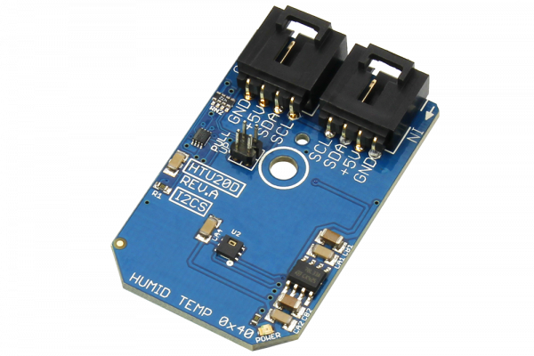

[](https://store.ncd.io/product/htu20d-humidity-and-temperature-sensor-%C2%B13rh-%C2%B10-3c-i2c-mini-module/).

# HTU20D

HTU20D is a new digital humidity sensor with temperature output of MEAS.This sensor provides calibrated, linearized signals in digital, I2C format. HTU20D digital humidity sensors are dedicated humidity and temperature plug-n-play transducers for OEM applications (where reliable and accurate measurements are needed).The resolution of this digital humidity sensor can be changed by command (8/12bit up to 12/14bit for RH/T).
This Device is available from www.ncd.io

[SKU: HTU20D]

(https://store.ncd.io/product/htu20d-humidity-and-temperature-sensor-%C2%B13rh-%C2%B10-3c-i2c-mini-module/)
This Sample code can be used with Raspberry Pi.

Hardware needed to interface HTU20D humidity and temperature sensor With Raspberry Pi :

1. <a href="https://store.ncd.io/product/htu20d-humidity-and-temperature-sensor-%C2%B13rh-%C2%B10-3c-i2c-mini-module/">HTU20D humidity and temperature Sensor</a>

2. <a href="https://store.ncd.io/product/i2c-shield-for-raspberry-pi-3-pi2-with-outward-facing-i2c-port-terminates-over-hdmi-port/">Raspberry Pi I2C Shield</a>

3. <a href="https://store.ncd.io/product/i%C2%B2c-cable/">I2C Cable</a>

## Python

Download and install smbus library on Raspberry pi. Steps to install smbus are provided at:

https://pypi.python.org/pypi/smbus-cffi/0.5.1

Download (or git pull) the code in pi. Run the program.

```cpp
$> python HTU20D.py
```
The lib is a sample library, you will need to calibrate the sensor according to your application requirement.

